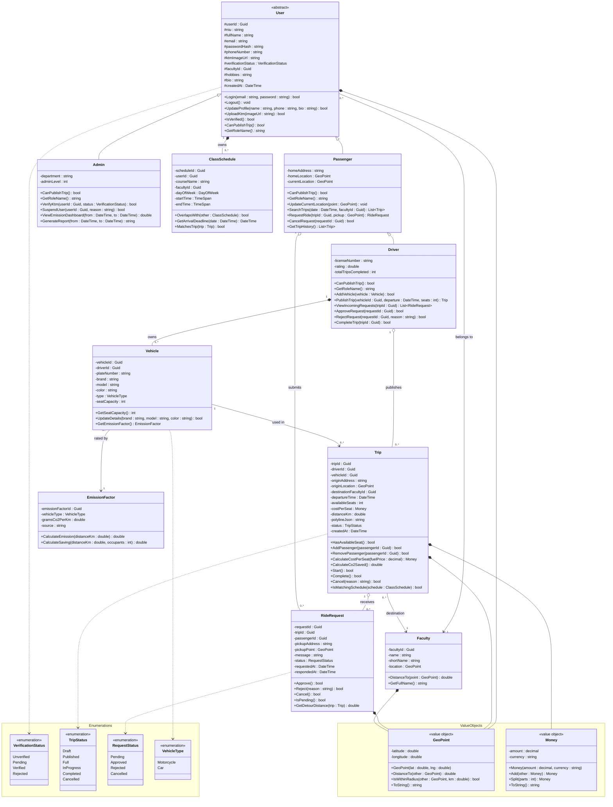

# BarengIn
Social carpooling for university students, matched by class schedule. Junior Project (OOP & Databases), DTETI FT UGM.

## About the Project
BarengIn is a carpooling and ride sharing platform built specifically for university students in Indonesia. By matching students' class schedules and destination faculties.

The app connects **Drivers** (students who already commute with a private vehicle and have empty seats) with **Passengers** (students without a vehicle who need a reliable, precisely timed ride to campus). Every user verifies their identity with their student ID (KTM), ensuring a safer and more trustworthy environment than conventional ride hailing apps.
Beyond just transportation, BarengIn layers in _social profiles_, such as hobbies and short bios so that daily commutes become an opportunity to meet like minded peers, giving drivers full control to approve or decline ride requests with zero pressure from the system.

The platform was created to address three interconnected problems on Indonesian campuses: chronic traffic congestion at campus gates driven by single occupancy commuting, the financial burden of daily transportation for students without vehicles, and the untapped potential for social connection during otherwise mundane commutes.

## Problem Statement
- Traffic congestion at campus gates caused by single occupancy commuting
- Unaffordable or unscheduled transport options for students without a vehicle
- Uneven cost burden on students who do own a vehicle
- Low social interaction during daily commutes
- No visibility into commute related carbon emissions

## Key Features
- Student ID (KTM) verification
- Automatic schedule and route matching between drivers and passengers
- Real time GPS tracking during a trip
- Social profiles with approve/reject matching
- Flexible, driver set cost sharing
- Admin dashboard for reports and CO2 savings analytics

## Climate Action Alignment
BarengIn reduces vehicle trips per capita by consolidating single occupancy commutes into shared rides, and gives campus administrators visibility into estimated emissions reduced through the admin dashboard.

## Team

BarengIn

- Member 1: Altaf Parves Shua Ilham – 24/536741/TK/59565
- Member 2: Calvin
- Member 3: M Dimas Dwi Ananda
- Member 4: Diffie Alfierie Iswanto

| Role | Name | NIU |
|---|---|---|
| Software Architect | Altaf Parves Shua Ilham | 24/536741/TK/59565 |
| Backend Engineer | Calvin | 24/532894/TK/59025 |
| Frontend Engineer | M Dimas Dwi Ananda | 24/536904/TK/59594 |
| Frontend Engineer | Diffie Alfierie Iswanto | 24/533049/TK/59056 |

## Tech Stack
| Layer | Technology |
|---|---|
| Platform | Platform (web vs. mobile, decision pending) |
| Backend | C#, ASP.NET Core 8 Web API |
| Database | PostgreSQL, Entity Framework Core |
| Real time | SignalR |
| Frontend | TBD, pending platform decision |

## Similar Apps
Gojek/GoCar, Grab, and BlaBlaCar are the closest comparisons. BarengIn differentiates on schedule based matching, social profiles, and a campus specific climate impact dashboard.

## Project Status
In development. Module 1 (concept, repo setup, GitHub Page) is in progress, with architecture and API design next.

## Module 3 — Class Design

